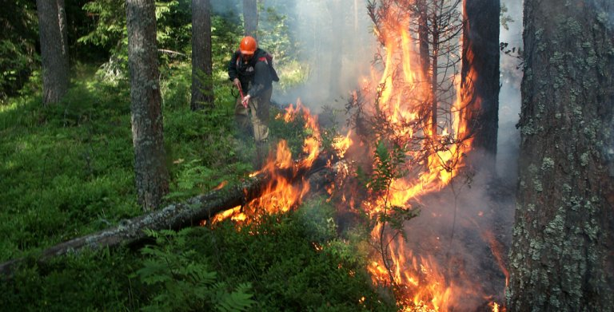

# Forest fires forecasting


[](https://mypy-lang.org/)
[](https://opensource.org/licenses/MIT)

<div align="center">
    
</div>

This project presents an example of solving a data prediction problem using regression and correlation analysis.

Based on data on natural fires from 2000 to 2019 in the Khanty-Mansi Autonomous Okrug-Yugra, the number of fires, the total area of fires and the total area of forest fires in 2020 were predicted.

This forecast was not intended to predict the occurrence of fires in a particular area. The purpose of the forecast was to estimate the total area without reference to territories. This was required by the local authorities of the region to plan the amount of funding for extinguishing natural fires at the beginning of the calendar year, that is, long before the start of the fire season in the region (May-August).

Data on average monthly precipitation and temperature were also used for forecasting. Unfortunately, in open sources, only for some settlements (Khanty-Mansiysk, October, Leushi, Lariak and Ugut), it was possible to find a weather archive for the period from 2000 to 2020, broken down by months. Further, on the basis of statistics on fires, a reference settlement was determined, the weather values in which were taken as an average value for the region.

Based on the results of the fire season, the deviation of the forecast for the total area was no more than 15%.

## Setting up and running the project 🚀

### Prerequisites
Clone repository:
```bash 
git clone https://github.com/Nkeramov/forest_fires_forecasting.git
```
Switch to repo directory:
```bash 
cd ner_analyzer
```
### Traditional method with venv and pip
Create and activate virtual environment:
```bash 
python -m venv .venv 
source .venv/bin/activate       # Linux/Mac
# or
./env/Scripts/activate          # Windows
```
Install dependencies and run:
```bash
pip install -r requirements.txt
python main.py
```
### Modern method with uv
Install dependencies and create virtual environment automatically:
```bash
uv sync
```
Run the project (virtual environment is handled automatically):
```bash
uv run python main.py
```
Or with explicit activation:
```bash
source .venv/bin/activate       # After uv sync
python main.py
```
